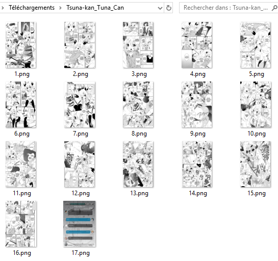
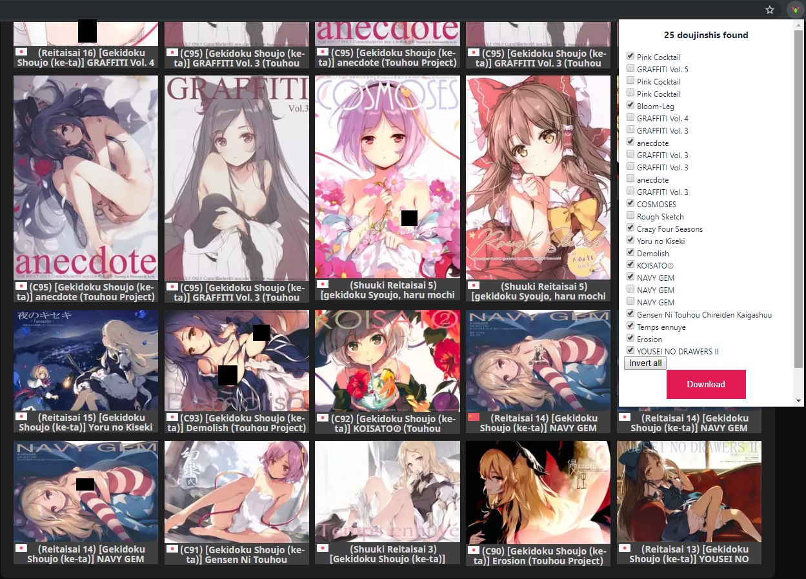
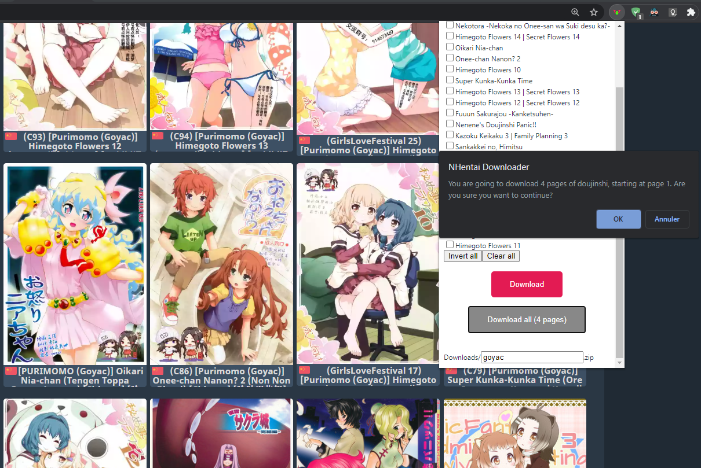
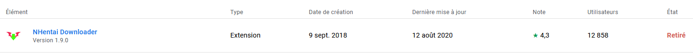

# NHentai Downloader — Manifest V3

A Chrome/Edge/Brave extension to download doujinshi from [nhentai.net](https://nhentai.net).  
Updated for **Manifest V3** with an offscreen document for reliable ZIP downloads, active-tab Cloudflare fallback, and deterministic fixture tests.

[](https://github.com/Xwilarg/NHentaiDownloader/actions)

---

## Features

- **Single download** — Open a gallery page, click the extension icon, and download as ZIP, CBZ, PDF, or raw images. The popup is split in two columns: the current gallery (format picker, filename, Download) on the left and a **Similar galleries** picker on the right.
- **Similar galleries** — On a gallery page, the popup's right column loads nhentai's related recommendations as a checkbox list; pick the ones you want and each selected gallery downloads as its own titled file (ZIP/CBZ/PDF/raw per the same format picker).
- **Batch download** — On search, tag, artist, category, or favorites pages, check the boxes injected next to each gallery card and download them all at once.
- **Multi-page download** — From listing pages with pagination, download galleries across several pages in one operation.
- **Name templates** — Customise filenames with placeholders: `{pretty}`, `{english}`, `{japanese}`, `{id}`, `{artist}`, `{group}`, `{character}`, `{language}`.
- **Duplicate handling** — Choose whether to auto-rename or ignore duplicate titles in batch downloads.
- **Concurrent downloads** — Adjust the number of parallel image fetches (1–15) to balance speed against server errors.
- **Cloudflare resilience** — If the extension-origin API request is blocked, metadata is retrieved from the already-open browser tab (same-origin, with Cloudflare clearance cookies).
- **HTML parsing fallback** — When the JSON API is unavailable, extract gallery metadata from the page HTML.

---

## Screenshots

| Single gallery | Batch listing | Multi-page |
|---|---|---|
|  |  |  |

---

## How it works

1. **Popup** — Clicking the extension icon on an nhentai page opens a popup that detects whether you are on a single gallery or a listing page.
2. **Metadata** — Gallery info comes from nhentai's API v2 (`nhentai.net/api/v2/galleries/<id>`), from the SvelteKit JSON payload embedded in the open gallery page, or from the legacy `window._gallery` embed. In **API key mode** (see below) the official keyed API is tried first; otherwise metadata resolves through the active browser tab's page context.
3. **Checkboxes** — On listing pages the content script injects checkboxes next to each gallery card. Tick the ones you want and press **Download** in the popup.
4. **Download engine** — Images are fetched through the open nhentai tab when a tab id is available (page origin and cookies), then from the extension origin. The image server list is resolved per session from `nhentai.net/api/v2/cdn` (validated HTTPS `*.nhentai.net` origins, API order first), with automatic fallback through the built-in mirrors (`i.nhentai.net`, `i1`–`i4`). If nhentai reports image hosts the extension has no permission for, the popup offers a one-click **Grant image host access** (optional `https://*.nhentai.net/*` permission — downloads keep working on the permitted hosts either way). HTML challenge responses are rejected so they never end up inside a ZIP.
5. **Archive / PDF output** — ZIP and CBZ archives are named after the gallery with the numbered pages directly at the archive root (no double `Title/Title` folder when extracting). **PDF** assembles the same pages into one `<Title>.pdf` (JPEG pages are embedded as-is; other formats are converted). In supported browsers an **offscreen document** assembles the result (and creates the real object URLs, no base64 memory blow-up) and survives service-worker idle timeouts. Raw mode saves the numbered pages (`001.jpg`, `002.png`, …) inside a `Downloads/<Title>/` folder.
6. **Saving** — The offscreen document only uses the APIs Chrome actually exposes there (`chrome.runtime`); finished objects are saved by the **service worker** via `chrome.downloads` (raw mode hands the original CDN URL to the same download manager).

---

## 403 / Cloudflare errors

nhentai uses Cloudflare, which may challenge requests that appear automated. The extension mitigates this by:

- Retrieving metadata from the **active browser tab** (`window._gallery` / embedded JSON) instead of hitting `/api/gallery` from the extension origin first.
- Fetching ZIP pages through that **same open tab** when possible, then falling back to an extension-origin CDN request.
- Requesting batch metadata and listing pages through the **open nhentai tab's session** (which carries any completed challenge clearance) before falling back to the extension origin.
- Offering an **HTML parsing** option (Settings → Advanced → Use HTML to get API info) that extracts gallery data from the rendered page.
- Falling back through CDN mirrors when an image server returns a non-image response, and never adding HTML or tiny bodies to the ZIP.
- Resolving the current image server list from `GET /api/v2/cdn` once per session (through the open tab's session when possible) instead of trusting one hardcoded mirror; anything that is not an HTTPS nhentai-owned origin is rejected.

This is **not** a Cloudflare bypass. If the tab is still “Just a moment…”, there is no gallery JSON and no image bytes to read. If metadata succeeds but images fail, keep the gallery tab open after the challenge and try again.

If you still see 403 errors:
- Make sure you are logged into nhentai in the active tab.
- Try again with a different VPN/proxy endpoint.
- Or switch to **API key mode** (next section), which uses nhentai's official API authentication for third-party clients.

---

## API key mode (optional)

nhentai's official API v2 documents API keys as the authentication method for third-party clients: generate one at **nhentai.net → account settings → API keys** and it is sent as `Authorization: Key YOUR_API_KEY`.

On first use the popup shows a gate with two explicit exits:

- **Submit key** — enters **API key mode**.
- **Continue without API key** — enters **open tab mode** (the previous behaviour). The choice is remembered; the key can later be set or cleared in the extension options.

### Mode boundaries

| Concern | API key mode | Open tab mode (no key) |
|---|---|---|
| Metadata route order | keyed official API → open-tab read → plain fetch | open-tab read → plain fetch (unchanged) |
| `Authorization` header | `Key <key>` on `nhentai.net/api/` requests only | never created |
| `429` handling | honoured with `Retry-After` backoff | n/a |
| Batch downloads | do not depend on reading the open tab | resolve through the open NHentai tab only |
| One-shot server archives | available (opt-in) | not available (endpoint requires auth) |

**Shared by both modes** (unified core): the download engine (page queue, retries, exponential backoff, ZIP/CBZ assembly, raw and folder outputs, object-URL delivery), parsing/normalisation, Cloudflare-challenge detection, content scripts, popup UI, progress/summary messages, and the hidden same-tab fallback frame.

Notes:

- The key is stored in `chrome.storage.local` only — it never syncs to other devices, never reaches content scripts, and is only ever attached to `nhentai.net/api/` URLs (never to CDN media URLs).
- The key (and the gate decision / archive toggle) is persistent: it survives closing the browser, browser restarts, and disabling/re-enabling the extension. Only **Clear key** in the options, uninstalling the extension, or wiping the browser's extension data removes it.
- An invalid key can never break a download: a failing keyed request falls through to the open-tab routes.
- This is not a Cloudflare bypass; it is the site's official API contract for clients.

### One-shot server archive downloads (experimental)

With an API key, the extension can ask `POST /api/v2/galleries/<id>/download?format=zip|cbz` for a ready-made archive instead of fetching every page (the API docs designate this endpoint for full-gallery archives). Enable it in the options (**Use one-shot server archive downloads**). It applies to ZIP/CBZ output only, and any failure (invalid key, feature flag off, rate limit, network error) automatically falls back to the page-by-page pipeline.

---

## Installation

### From the Release folder (development build)

1. Go to the extension's folder (`NHDW_Release_v3.0.0`).
2. Open `chrome://extensions/` in Chrome/Brave/Edge.
3. Enable **Developer mode** (top right).
4. Click **Load unpacked** and select the `NHDW_Release_v3.0.0` folder.

### Firefox

The original extension supported Firefox; the MV3 version requires `chrome.offscreen` and `chrome.scripting` APIs that are not available in Firefox. Use the [legacy release](https://github.com/Xwilarg/NHentaiDownloader/releases) for Firefox.

---

## Options

| Setting | Description |
|---|---|
| **Download format** | ZIP, CBZ, PDF, or Raw (numbered images in a titled folder) |
| **Display checkboxes** | Show/hide selection checkboxes on listing pages |
| **Dark mode** | Dark theme for the popup |
| **Duplicate behaviour** | Rename duplicates with a suffix or ignore them |
| **Download separately** | Each selected gallery as its own archive |
| **HTML parsing** | Use page HTML instead of the API for metadata |
| **Max concurrent downloads** | Parallel image fetches (1–15) |
| **nhentai API key** | Optional key for API key mode (stored locally, never synced) |
| **Server archive downloads** | Experimental one-shot ZIP/CBZ via the API (requires key) |
| **Name template** | Filename with placeholders (see below) |
| **Replace spaces** | Replace spaces with underscores in filenames |

### Name template placeholders

| Placeholder | Description |
|---|---|
| `{pretty}` | Pretty title |
| `{english}` | English title |
| `{japanese}` | Japanese title |
| `{id}` | 6-digit gallery ID |
| `{artist}` | Artist name(s) |
| `{group}` | Group/circle name(s) |
| `{character}` | Character name(s) |
| `{language}` | Language tag |

---

## Building from source

```bash
cd NHDW_Extension_v3.0.0
npm install
npm run build        # produces js/*.js
```

The built files go into `js/`. Copy them to the release folder:

```bash
cp -a js/. ../NHDW_Release_v3.0.0/js/
```

### Running tests

```bash
npm test                          # 149 fixture tests (offline)
npm run test:smoke                # smoke checks for background + offscreen
npm run test:e2e                  # window-less end-to-end pipeline tests
npm run test:live                 # optional live nhentai API test
```

---

## A quick note about the Chrome Web Store

This extension was removed from the Chrome Web Store on 04/12/2020 because it does not comply with the store's content policy (mature content).  
Over its 2-year store presence it had a rating of 4.3/5 and 12 858 users.



---

## License

MIT